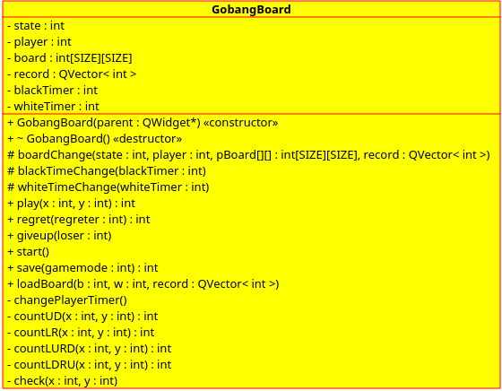
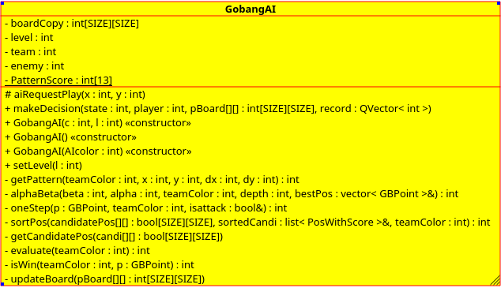
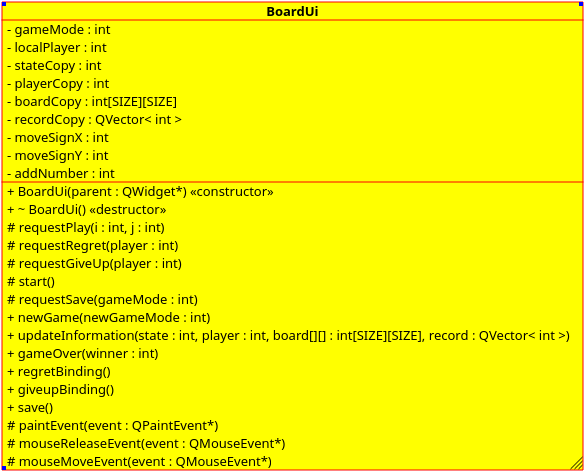
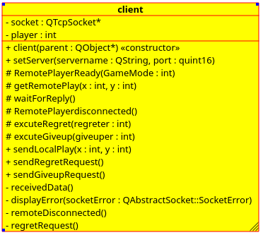
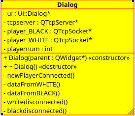

# 面向对象程序设计大程序文档
成员：
3150102277 范宏昌 
3150 方共凡
3150 杜众舒 
3140103103 郑济元 

## 总体概述及功能介绍
本五子棋游戏采用c++作为开发语言,使用了QT跨平台库，具有以下功能：
- 本机人人对战模式
	1. 该模式下黑白两方玩家轮流在一个棋盘上下棋
	2. 上一次落子的一方玩家可以进行悔棋
	3. 轮到自己下棋的一方玩家可以进行认输
	4. 游戏中途可以保存对局,可在以后选择加载对局
	5. 游戏结束可以保存游戏棋谱(带落子顺序标记)
- 本机人机对战模式
	1. 该模式下默认玩家执黑,电脑AI执白,轮流在一个棋盘上下棋
	2. 玩家可以进行悔棋
	3. 玩家可以进行认输
	4. 游戏中途可以保存对局，可在以后选择加载对局
	5. 游戏结束可以保存游戏棋谱(带落子顺序标记)
- $网络人人对战模式^*$
	1. 该模式下黑白两方玩家各自开一个客户端,连接上服务器后，分别在自己的棋盘上下棋
	2. 任一方玩家可以在轮到自己下和轮到对方下时申请进行悔棋，待对方同意后即可悔棋
	3. 任一方玩家可以在轮到自己下和轮到对方下时进行认输
	4. 游戏结束可以保存游戏棋谱(带落子顺序标记)

## 使用方法

## 组件（各类）间工作原理
- client
	1. 客户端类，负责与服务端建立连接并通信，在连接成功并服务器端发来开始信号后创建新的一局游戏。
	2. 与主界面的输入相连接，在游戏中发送本地玩家的操作到另一名玩家并接收另一名玩家的操作模拟实施到本地。
	3. 接收本地玩家的悔棋请求并询问另一位玩家的同意。
	4. 接收本地玩家的认输请求并通知另一位玩家。
	### 发送数据功能 sendLocalPlay()
	`void sendLocalPlay(int x, int y);`
	- 将本地的下子位置发送到服务器
	### 请求悔棋功能 sendRegretRequest()
	`void sendRegretRequest();`
	- 向另一位玩家发送悔棋请求，对方会被要求选择是否同意，若同意则悔一步棋
	### 请求认输功能 sendGiveupRequest()
	`void sendGiveupRequest();`
	- 向另一位玩家发送认输请求，结束当前游戏，对方为胜利者
	### 收到游戏开始信号 RemotePlayerReady()
	`void RemotePlayerReady(int GameMode);`
	- 收到该信号表示另一位玩家准备完毕，将开始游戏
	- 新游戏的本地玩家身份由GameMode指定
	### 收到下子信号 getRemotePlay()
	`void getRemotePlay(int x,int y);`
	- 收到该信号表示另一名玩家在x,y位置下了子
	### 执行悔棋信号 excuteRegret()
	`void excuteRegret(int regreter);`
	- 收到该信号表示对方或本地同意悔棋，将以悔棋者为regreter的形式进行悔棋
	### 执行认输信号 excuteGiveup()
	` void excuteGiveup(int giveuper);`
	- 收到该信号表示对方或本地认输，将以认输者为giveuper的形式进行悔棋
	### 另一玩家断开连接信号 RemotePlayerdisconnected()
	`void RemotePlayerdisconnected();`
	- 收到该信号表示另一玩家的连接被断开，游戏直接结束
- server
	1. 服务端类，负责监听客户端的连接请求，并在双方连接后提供转发服务
	2. 记录目前服务端的连接数，分配两个玩家的身份
	3. 在一方玩家断开后断开另一个玩家，初始化服务端（目前仅支持1对玩家进行游戏）
	### 新玩家连接 newPlayerConnected()
	`void newPlayerConnected();`
	- 有新玩家连接，若目前无人连接，则发送等待信号让客户端等待，若有1人已连接，则向双方发送游戏开始信号，更多玩家则忽略（目前仅支持1对玩家进行游戏）
	### 白方发来数据 dataFromWHITE()
	`void dataFromWHITE();`
	- 摆放
   `void dataFromBLACK();`
    `void whitedisconnected();`
    `void blackdisconnected();`
## 各类详细uml图
- GobangBoard(棋盘底层存储)

- GobangAI(电脑AI)

- BoardUi(棋盘界面)

- Client(客户端类)

- Dialog（带界面服务器类）

## 各源代码文件介绍
- 客户端部分主程序
`gobangclient/main.cpp`
- 定义了整个程序中用到的宏名
`gobangclient/marcos.h`
- 主窗口的头文件、cpp文件和ui设计文件
`gobangclient/mainwindow.h`，`gobangclient/mainwindow.cpp`，`gobangclient/mainwindow.ui`
- 棋盘界面类的头文件、cpp文件
`gobangclient/boardui.h`，`gobangclient/boardui.cpp`
- 客户端类的头文件、cpp文件
`gobangclient/client.h`，`gobangclient/client.cpp`
- 电脑AI类的头文件、cpp文件
`gobangclient/gobangai.h`，`gobangclient/gobangai.cpp`
- 棋盘底层存储类的头文件、cpp文件
`gobangclient/gobangboard.h`，`gobangclient/gobangboard.cpp`
- 服务器类头文件、cpp文件和ui设计文件
`gobangserver/dialog.h`，`gobangserver/dialog.cpp`，`gobangserver/dialog.ui`，
- 服务器端主程序
`gobangserver/main.cpp`

